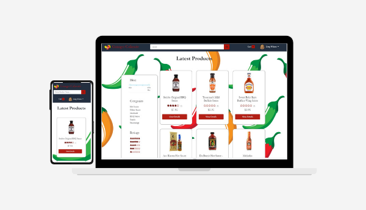
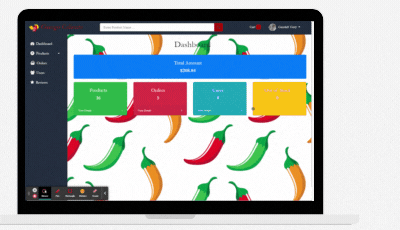

# Gringo Caliente

* [Description](#description)
* [Usage](#usage)
* [Technologies Used](#technologies-used)
* [Challenges](#challenges)
* [Future Developments](#future-developments)

    

## Description

Gringo Caliente is a MERN Stack hot sauce marketplace that is fully responsive, uses JSON Web Tokens for authentication and redux for state managment.  Shoppers can create profiles which will save previous orders and show the status of their orders.  Users can be upgraded to Admins where they will be able to view, edit, and delete all products, user, reviews and orders.  These admin pages are protected and cannot be viewed unless a user is authenticated as an admin. 

---

## Usage

Gringo Calientes usage can be divided into two parts: User and Admin.  Guests can browse the site, but must register to make a purchase.  Admins can manage all aspects of the website.

#### Users

    

Users are able to make purcahses from the store.  I used local storage to save their cart while they are browsing, and also to store previous addresses.  Upon a completed purchase the cart is reset (although it must be refreshed to show).  A user has the ability to change their profile including their avatar, update their password, and also view a previous order list that if an order is clicked show the order details. Each of these actions is manged by redux which dispatches an api call to a given route on the back end. The profile and orders options are conditionally rendered with user authentication. To test the user functionality feel free to create a new profile!

---

#### Admins

    

Admins can do everything that users are able to do with the addition of being able to access the admin dashboard. From the dashboard admins are able to perform CRUD operations on products, users, orders, and reveiws. Each of these actions is manged by redux which dispatches an api call to a given route on the back end. In the products section an admin can create new products, view and edit all products, and delete a product.  Reviews can only be viewed or deleted.  Admins can view users, delete them, and also edit their name, email, or role. Orders can only be deleted if not delivered yet. Orders staus can be changed between processing, shipped, and Delivered. 

---

## Technologies Used

## Challenges

## Future Developments

