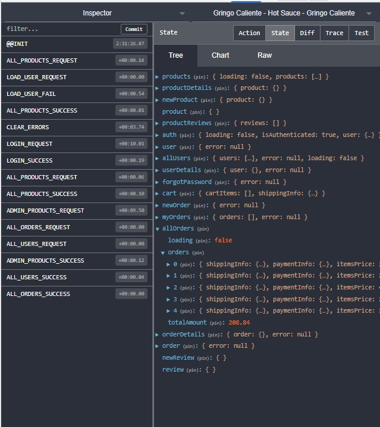
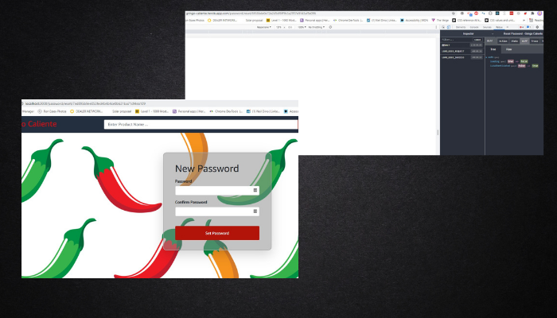

# Gringo Caliente

* [Description](#description)
* [Usage](#usage)
* [Technologies Used](#technologies-used)
* [Challenges](#challenges)
* [Future Developments](#future-developments)

    

## Description

Gringo Caliente is a MERN Stack hot sauce marketplace that is fully responsive, uses JSON Web Tokens for authentication and redux for state managment.  Shoppers can create profiles which will save previous orders and show the status of their orders.  Users can be upgraded to Admins where they will be able to view, edit, and delete all products, user, reviews and orders.  These admin pages are protected and cannot be viewed unless a user is authenticated as an admin. 

---

## Usage

Gringo Calientes usage can be divided into two parts: User and Admin.  Guests can browse the site, but must register to make a purchase.  Admins can manage all aspects of the website.

#### Users

    

Users are able to make purcahses from the store.  I used local storage to save their cart while they are browsing, and also to store previous addresses.  Upon a completed purchase the cart is reset (although it must be refreshed to show).  A user has the ability to change their profile including their avatar, update their password, and also view a previous order list that if an order is clicked show the order details. Each of these actions is manged by redux which dispatches an api call to a given route on the back end. The profile and orders options are conditionally rendered with user authentication. To test the user functionality feel free to create a new profile!

---

#### Admins

    

Admins can do everything that users are able to do with the addition of being able to access the admin dashboard. From the dashboard admins are able to perform CRUD operations on products, users, orders, and reveiws. Each of these actions is manged by redux which dispatches an api call to a given route on the back end. In the products section an admin can create new products, view and edit all products, and delete a product.  Reviews can only be viewed or deleted.  Admins can view users, delete them, and also edit their name, email, or role. Orders can only be deleted if not delivered yet. Orders staus can be changed between processing, shipped, and Delivered. Authentication was done through JSON webtokens

---

## Technologies Used

MongoDB | React | Redux | Mongoose | NodeMailer | Cloudinary | BCrypt | Express | Stripe | JSON Web Tokens | Axios | Thunk | usa-states | React Alert | Heroku

#### Backend

The API was build primarily using NodeJS and Express with MongoDB as the database.  Express was used to create all of the routes for users, orders, and products. Custom middle ware files were created to handle the error handling, the api search, filter and pagination features, and also for sending emails with node mailer for the password recovery.  There was some backend setup to get Cloudinary as well as stripe working. All of the admin routes use authentication to make sure the user has a role of 'admin'.  A few other routes can also only be completed with authenticated users with a role of 'user' or 'admin'.  

#### Frontend

    

The frontend was created with React.  A global state was used to manage all of the actions performed with Redux.  Thunk middle ware was used to allow promises in the actions.  Many pages use the useEffect hook to dispatch actions, and update the page when states are changed.  The useState hook was used mostly for collecting form information.  A lot of the JSX and CSS were given from the Udemy class I used as reference for this project.  React alert was used to throw success and error messages and React-helmet was used to allow differnt titles to be viewed on the browser tabs on different pages.

---

## Challenges

There were a lot of things new for me in this project.  It was my first deep dive into useing redux, first time using cloudinary, and first time setting up password recovery. I had some issues with many routes not working once deployed on heroku (they may have been broken before).  I feel I could add some automated testing in the future to prevent deploying with some functionality not working.

#### Cloudinary
Cloudinary I had several setbacks with it not working.  One was small syntax errors setting up the api keys in my ENV file.  I also had some issues when changing the profile image which also ended up being a small syntax error.  I am still working through trying to get a user registered without adding a profile image, which I will need to add a conditional statement in my register route.  One error I am not entirely sure how to fix is if a large image is uploaded I get a base 64 error through cloudinary.

#### Stripe
I had some problems getting stripe working properly.  I had some issues getting the api keys sent from the backend to the frontend.  Also for some reason on my deployed site after there is data in the cash after making one purchase, sometimes the payment screen needs to be loaded before it shows up.  I am trying to find a fix for this as well. 

#### Heroku

    

I have used heroku in the past and it has usually gone pretty smoothly.  Upon my first deployment many routes were not working.  I figured out that I had to add tons more environment variables this time, and also needed to fix some routes and my heroku scripts for how I had my file structure.  One bug that I am still perplexed on is that my local password recoveryt works perfectly, but on heroku I can say forgot password, get an email, but when I navigate to the custom link sent to the mailtrap (email simulator), for some reason the LOAD_USER action comes back as authenticated true causing the new password screen not to load. The other issue is the free verion of heroku is incredibly slow. I would like to find an alternative for my next project. 

---

## Future Developments

* Automated testing for the actions on the frontend would have prevented a lot of headaches at the end when I went to deploy.  If I do not add them to this project I will for sure be using some tests on my next.
* Recommended products.  I would like to add some recommended products based on similar categories or heat and randomly display a few.
* Coupons - I would like to also eventually add coupons to this which would require a new model on the backend and could be done fairly easily. 